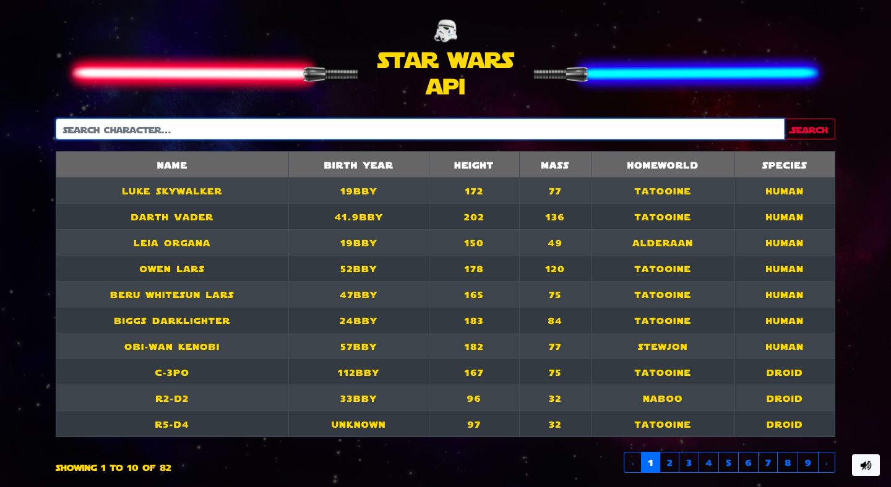

# Star Wars API Table

Try it out! [Application Link](https://ar-starwars-table.herokuapp.com/)

Search through all of Star Wars characters and their details.

## Description

This application's goal was to gain more experience with API requests and Heroku as a hosting platform. In this app, you can search through all of Star Wars characters. I am using swapi(Star Wars API) to get the data. Using react-bootstrap, I put together a dynamic table, a search bar, and a pagination feature that all work together to deliver a more refined experience. Also, if you feel the Star Wars spirit, you can always immerse yourself further by clicking on the volume button to enable one of the Star Wars classic soundtracks while you learn more about its characters. This project was a lot of fun to make, and I learned a lot about Heroku, creating a dynamic, searchable table and how to cache data from the APIs to reduce the number of calls. 

## Technologies/Design
- React, project was created using create-react-app
- Heroku, hosting platform
- React Bootstrap

## Author
- Aliel Reyes - Software Developer 
    - [Portfolio](https://alielreyes.netlify.app/)
    - [LinkedIn](https://www.linkedin.com/in/alielreyes/).

